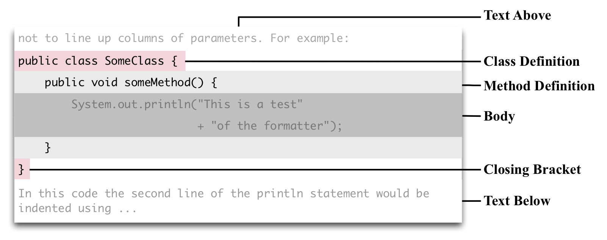
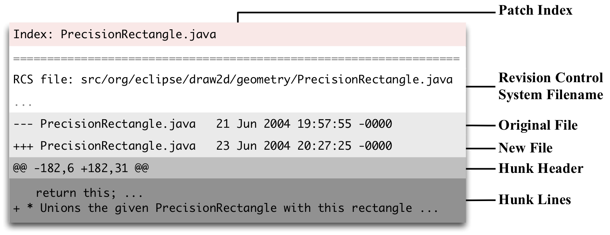
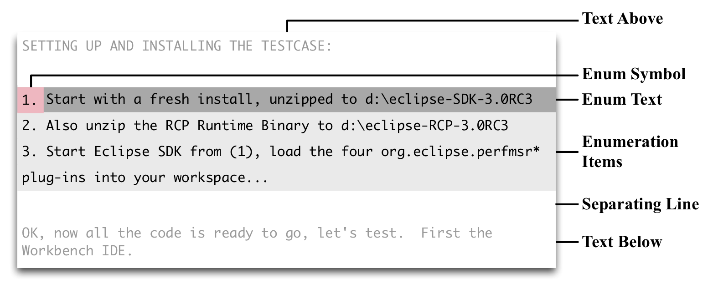
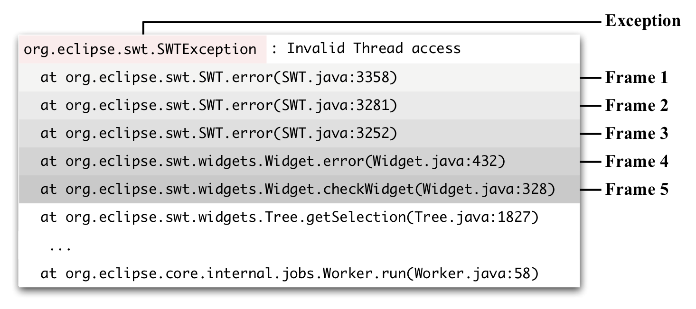
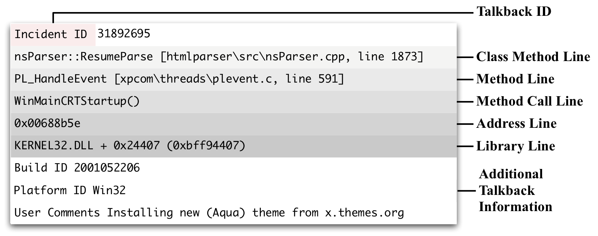

# infoZilla
The `infoZilla` tool is a library and tool for extracting structural software engineering data from unstructrured data sources such as e-mails, discussions, bug reports and wiki pages.

Out of the box, the `infoZilla` tool finds the following artefacts:

## Java Source Code Regions
Source code as small- to medium-sized code examples are often used to illustrate a problem, describe the programming context in which a problem occurred, or represent a sample fix to the problem described in the text.



## Patches

Patches represent a small piece of software designed to update or fix problems with a computer program or supporting data. The mostly used format of patches is the unified diff format.



## Enumerations and Itemizations
Enumerations and itemizations are used to list items, describe a chain of causality, or present a sequence of actions the developer has to take in order to be able to reproduce or fix a problem. They add structure to the description of a problem and  ease understanding.



## Java Stacktraces
Stack traces list the active stack frames in the calling stack upon execution of a program. They are widely used to aid bug fixing by giving hints at the origin of a problem.



## Talkback Traces
Talkback traces detail the crash contexts and environment details when a problem is detected.



## Usage
```
Usage: infozilla [-clps] [--charset=<inputCharset>] FILE...
      FILE...              File(s) to process.
      --charset=<inputCharset>
                           Character Set of Input (default=ISO-8859-1)
  -c, --with-source-code   Process and extract source code regions (default=true)
  -l, --with-lists         Process and extract lists (default=true)
  -p, --with-patches       Process and extract patches (default=true)
  -s, --with-stacktraces   Process and extract stacktraces (default=true)
```

## Quickstart
Run the tool against a sample bug report:

```
gradle run --args="demo/demo0001.txt"

Task :run
Extracted Structural Elements from demo/demo0001.txt
0        Patches
2        Stack Traces
4        Source Code Fragments
1        Enumerations
Writing Cleaned Output
Writing XML Output
```

This will produce two files: 
- `demo/demo0001.txt.cleaned` which contains the natural langauge text with all structural elements removed. This output is useful when the goal is to apply NLP algorithms that would otherwise be applied to large chunks of non-NLP data.
- `demo/demo001.txt.result.xml` which contains a machine-parseable representation of all structural elements that were found in the input.

### Example XML Output
```xml
<?xml version="1.0" encoding="UTF-8"?>
<infozilla-output>
  <Patches amount="0" />
  <Stacktraces amount="2">
    <Stacktrace timestamp="1547858607503">
      <Exception>org.eclipse.core.internal.resources.ResourceException</Exception>
      <Reason>Resource /org.eclipse.debug.core/.classpath is not local.</Reason>
      <Frames>
        <Frame depth="0">org.eclipse.core.internal.resources.Resource.checkLocal(Resource.java:313)</Frame>
        <Frame depth="1">org.eclipse.core.internal.resources.File.getContents(File.java:213)</Frame>
        <Frame depth="2">org.eclipse.jdt.internal.core.Util.getResourceContentsAsByteArray(Util.java:671)</Frame>
        <Frame depth="3">org.eclipse.jdt.internal.core.JavaProject.getSharedProperty(JavaProject.java:1793)</Frame>
        <Frame depth="4">org.eclipse.jdt.internal.core.JavaProject.readClasspathFile(JavaProject.java:2089)</Frame>
        <Frame depth="5">org.eclipse.jdt.internal.core.JavaProject.getRawClasspath(JavaProject.java:1579)</Frame>
        <Frame depth="6">org.eclipse.jdt.internal.core.search.indexing.IndexAllProject.execute(IndexAllProject.java:77)</Frame>
        <Frame depth="7">org.eclipse.jdt.internal.core.search.processing.JobManager.run(JobManager.java:371)</Frame>
      </Frames>
    </Stacktrace>
    <Stacktrace timestamp="1547858607503">
      <Exception>org.eclipse.core.internal.resources.ResourceException</Exception>
      <Reason>Resource /org.eclipse.jdt.launching/.classpath is not local.</Reason>
      <Frames>
        <Frame depth="0">org.eclipse.core.internal.resources.Resource.checkLocal(Resource.java:307)</Frame>
        <Frame depth="1">org.eclipse.core.internal.resources.File.getContents(File.java:213)</Frame>
        <Frame depth="2">org.eclipse.jdt.internal.core.Util.getResourceContentsAsByteArray(Util.java:677)</Frame>
        <Frame depth="3">org.eclipse.jdt.internal.core.JavaProject.getSharedProperty(JavaProject.java:1809)</Frame>
        <Frame depth="4">org.eclipse.jdt.internal.core.JavaProject.readClasspathFile(JavaProject.java:2105)</Frame>
        <Frame depth="5">org.eclipse.jdt.internal.core.JavaProject.getRawClasspath(JavaProject.java:1593)</Frame>
        <Frame depth="6">org.eclipse.jdt.internal.core.JavaProject.getRawClasspath(JavaProject.java:1583)</Frame>
        <Frame depth="7">org.eclipse.jdt.internal.core.JavaProject.getOutputLocation(JavaProject.java:1375)</Frame>
        <Frame depth="8">org.eclipse.jdt.internal.core.search.indexing.IndexAllProject.execute(IndexAllProject.java:90)</Frame>
        <Frame depth="9">org.eclipse.jdt.internal.core.search.processing.JobManager.run(JobManager.java:375)</Frame>
        <Frame depth="10">java.lang.Thread.run(Thread.java:536)</Frame>
      </Frames>
    </Stacktrace>
  </Stacktraces>
  <SourceCodeRegions amount="4">
    <source_code type="functioncall">
      <location start="3466" end="3479" />
      <code>(monitor,1));</code>
    </source_code>
    <source_code type="ifstatement">
      <location start="6059" end="6327" />
      <code>if (isJavaProject) {
	/*IJavaProject jProject = JavaCore.create(project);
	if (jProject.getRawClasspath() != null
		&amp;&amp; jProject.getRawClasspath().length &gt; 0)
		jProject.setRawClasspath(new IClasspathEntry[0], monitor);*/
	modelIds.add(model.getPluginBase().getId());
}</code>
    </source_code>
    <source_code type="ifstatement">
      <location start="6335" end="6538" />
      <code>if (isJavaProject) {
	IJavaProject jProject = JavaCore.create(project);
	jProject.setRawClasspath(new IClasspathEntry[0], project.getFullPath(),
monitor);
	modelIds.add(model.getPluginBase().getId());
}</code>
    </source_code>
    <source_code type="ifstatement">
      <location start="7483" end="7686" />
      <code>if (isJavaProject) {
	IJavaProject jProject = JavaCore.create(project);
	jProject.setRawClasspath(new IClasspathEntry[0], project.getFullPath(),
monitor);
	modelIds.add(model.getPluginBase().getId());
}</code>
    </source_code>
  </SourceCodeRegions>
  <Enumerations amount="1">
    <Enumeration lines="23">
      <Lines>
        <Line>1. If autobuilding is on, we turn it off.</Line>
        <Line />
        <Line>2. We import all the plug-ins selected in the import wizard and create a Java</Line>
        <Line>project for each plug-in that contains libraries.  Note that at this step, we</Line>
        <Line>used to clear the classpath of the freshly created Java project because we</Line>
        <Line>will correctly set it at a later step.  However, just before we released 2.1,</Line>
        <Line>Philippe suggested in bug report 34574 that we do not flush the classpath</Line>
        <Line>completely.  So we stopped flushing the classpath at this point, and this</Line>
        <Line>introduced the transient error markers that we now see in the Problems view in</Line>
        <Line>the middle of the operation.  Since these error markers go away later in step</Line>
        <Line>3 when we set the classpath, we regarded them as benign, yet still annoying,</Line>
        <Line>intermediary entities.  This step is done in an IWorkspace.run</Line>
        <Line>(IWorkspaceRunnable, IProgressMonitor) operation.</Line>
        <Line />
        <Line>3. We set the classpath of all the projects that were succesfully imported</Line>
        <Line>into the workspace. This step has to be done in a subsequent IWorkspace.run</Line>
        <Line>(IWorkspaceRunnable, IProgressMonitor) operation for an accurate classpath</Line>
        <Line>computation.  i.e. the Java projects from step 2 have to become part of the</Line>
        <Line>workspace before we set their classpath.</Line>
        <Line />
        <Line>4.  If we had turned autobuilding off in step 1, we turn it back on and invoke</Line>
        <Line>a build via PDEPlugin.getWorkspace().build</Line>
        <Line>(IncrementalProjectBuilder.INCREMENTAL_BUILD,new SubProgressMonitor</Line>
      </Lines>
    </Enumeration>
  </Enumerations>
</infozilla-output>
```

## Building
Building the infoZilla tool requires `gradle` 4 or newer. Run `gradle tasks` for an overview.


## Citing
If you like the tool and find it useful, feel free to cite the original research work:
```
@conference {972,
	title = {Extracting structural information from bug reports},
	booktitle = {Proceedings of the 2008 international workshop on Mining software repositories  - MSR {\textquoteright}08},
	year = {2008},
	month = {05/2008},
	pages = {27-30},
	publisher = {ACM Press},
	organization = {ACM Press},
	address = {New York, New York, USA},
	abstract = {In software engineering experiments, the description of bug reports is typically treated as natural language text, although it often contains stack traces, source code, and patches. Neglecting such structural elements is a loss of valuable information; structure usually leads to a better performance of machine learning approaches. In this paper, we present a tool called infoZilla that detects structural elements from bug reports with near perfect accuracy and allows us to extract them. We anticipate that infoZilla can be used to leverage data from bug reports at a different granularity level that can facilitate interesting research in the future.},
	keywords = {bug reports, eclipse, enumerations, infozilla, natural language, patches, source code, stack trace},
	isbn = {9781605580241},
	doi = {10.1145/1370750.1370757},
	attachments = {https://flosshub.org/sites/flosshub.org/files/p27-bettenburg.pdf},
	author = {Premraj, Rahul and Zimmermann, Thomas and Kim, Sunghun and Bettenburg, Nicolas}
}

```
